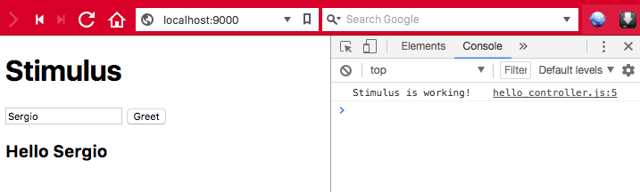

#  Stimulus Starter

This is a project basead on a preconfigured blank slate for exploring [Stimulus](https://github.com/stimulusjs/stimulus). Jump to [The Stimulus Handbook](https://github.com/stimulusjs/stimulus/blob/master/handbook/README.md) for a quick introduction.

---

To clone and set up this `stimulus-starter project`:

```
$ git clone https://github.com/sergiosouzalima/stimulus-starter.git
$ cd stimulus-starter
$ yarn install
$ yarn start
```

Now, to run this app, enter the following address in your browser address bar:

```
http://localhost:9000
```

You should see a screen like that:



--

You can see here an online version of this app [stimulus-starter](https://stimulus-starter.herokuapp.com)

---

© 2018 Basecamp, LLC.
## StimulusJS
